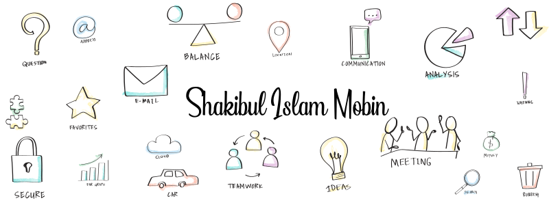

<h1 align="center">Shakibul Islam Mobin</h1>
<h3 align="center">A passionate frontend developer from BD</h3>

  

  

- 🌱 I’m currently learning **Data Structure**

- 💬 Ask me about **HTML,CSS,JS etc**

- 📞 Phone: **+88017 46301800**

- 📫 Email: **shakibulislammobin@gmail.com**

- ⚡ Me **🤨😒**

# Personal Portfolio

A simple and modern personal portfolio built using HTML and CSS. Showcase your skills, achievements, and projects with this stylish and responsive website.

## Features

- Responsive design for optimal viewing on all devices
- Clean and minimalist design
- Animations to enhance the user experience
- Contact form for easy communication with potential clients or employers

## Usage

To navigate through the pages, use the navigation bar located at the top of the page. The navigation bar will take you to the following sections:

- Home
- About
- Skills
- Projects
- Contact

## Screenshots
##### v.2022

.png)
.png)
.png)
.png)

________
___________________
____________________________
# Activity

&nbsp;

